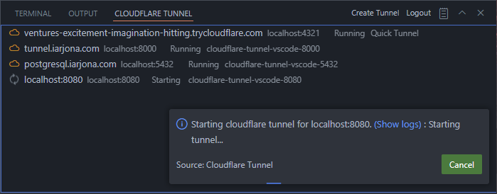
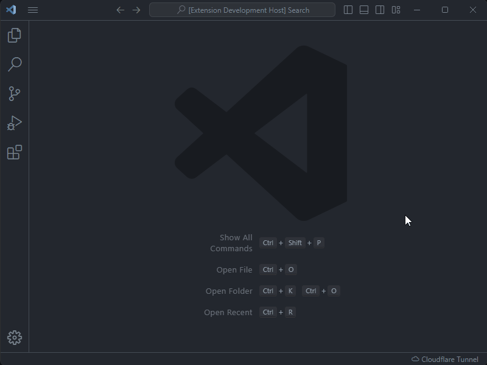

<div align="center">
    <h1>Cloudflare Tunnel for VSCode</h1>
    <a href="https://marketplace.visualstudio.com/items?itemName=IvanArjona.cloudflaretunnel">
        
    </a>
    <br>
    <br>
    <em>A Visual Studio Code extension to create a local tunnels so your local http server can be accessed remotely using <a href="https://www.cloudflare.com/es-es/products/tunnel/">Cloudflare Tunnel</a></em>
    <br>
    <br>
    <a href="https://marketplace.visualstudio.com/items?itemName=IvanArjona.cloudflaretunnel"></a>
    <a href="https://marketplace.visualstudio.com/items?itemName=IvanArjona.cloudflaretunnel&ssr=false#review-details"></a>
    <a href="https://github.com/IvanArjona/cloudflare-tunnel-vscode/blob/master/CHANGELOG.md"></a>
</div>

<hr>

<br>

<div align="center">
    
</div>

# Walkthrough
<div align="center">
    
</div>

# Features

- Start a local Cloudflare Tunnel accesible outside your network
- Specify your local port number
- Use any local hostname or ip address inside your network
- Use a custom subdomain. Login to cloudflare is required.

# Commands

Commands accesible from the Command Palette (<kbd>Ctrl</kbd> + <kbd>Shift</kbd> + <kbd>P</kbd>).

```
Cloudflare Tunnel: Create Tunnel
Cloudflare Tunnel: Stop Tunnel
Cloudflare Tunnel: Open Tunnel in browser
Cloudflare Tunnel: Copy tunnel uri to clipboard
Cloudflare Tunnel: Get version
Cloudflare Tunnel: Login
Cloudflare Tunnel: Logout
Cloudflare Tunnel: Focus on Tunnels View
Cloudflare Tunnel: Open panel
Cloudflare Tunnel: Output channel
```

# Using your custom domain

First login to you cloudflare account using running the command `Cloudflare Tunnel: Login` or clicking the `Login` button in the Cloudflare Tunnel panel.

Create a tunnel using the command `Cloudflare Tunnel: Create Tunnel` or clicking the `Create Tunnel` button in the Cloudflare Tunnel panel.

Select your local port and set as hostname a subdomain from one of your domains in cloudflare.
