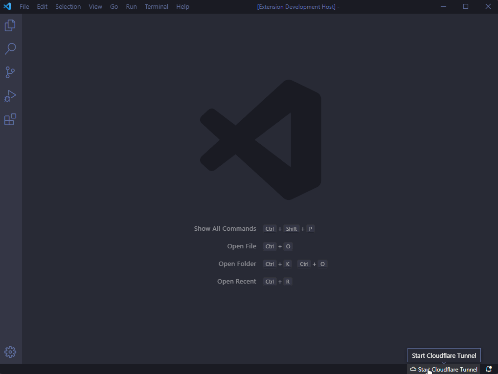

<div align="center">
    <h1>Cloudflare Tunnel for VSCode</h1>
    <a href="https://marketplace.visualstudio.com/items?itemName=IvanArjona.cloudflaretunnel">
        
    </a>
    <br>
    <br>
    <em>A Visual Studio code extension to crea a local tunnel so your local http server can be accessed remotely using <a href="https://www.cloudflare.com/es-es/products/tunnel/">Cloudflare Argo Tunnel</a></em>
    <br>
    <br>
    <a href="https://marketplace.visualstudio.com/items?itemName=IvanArjona.cloudflaretunnel"></a>
</div>

<hr>

<br>



# Features

- Start a local Cloudflare Tunnel accesible outside your network
- Specify your local port number
- Use any local hostname or ip address inside your network
- Use a custom subdomain. Login to cloudflare is required.

# Commands

Commands accesible from the Command Palette (<kbd>Ctrl</kbd> + <kbd>Shift</kbd> + <kbd>P</kbd>).

```
Cloudflare Tunnel: Start
Cloudflare Tunnel: Stop
Cloudflare Tunnel: Version
Cloudflare Tunnel: Is running?
Cloudflare Tunnel: Get url
Cloudflare Tunnel: Login
Cloudflare Tunnel: Logout
```

# Using your custom domain

First login to you cloudflare account using running the command `Cloudflare Tyunnel: Login`.

Go to your editor settings page file or edit your `settings.json`.

Set the setting `cloudflaretunnel.tunnel.hostname` to one subdomain not in use.
